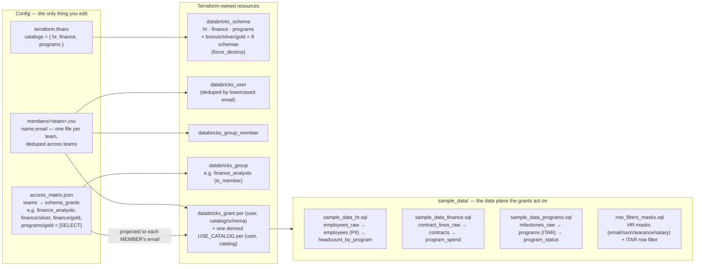
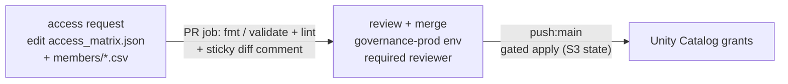

# governance — config-driven Unity Catalog permissions

Security automation config maps drive everything via `for_each`.
Adding a team, a catalog, or a member is a config edit not a new Terraform script.

## The model

> Unity Catalog only resolves **account-level** principals. `databricks_group`,
> driven by a workspace-scoped provider (the only credentials Free Edition hands
> out — the account SCIM API returns 401), creates **workspace-local** groups,
> which UC rejects as grant principals — you get
> `PRINCIPAL_DOES_NOT_EXIST: Could not find principal with name {group}`
> (the built-in `admins` fails the same way). Users, however, register at the
> account level and resolve by email.
>
> So the teams matrix is projected down to per-user grants: for each member of
> a team, `grants.tf` emits `databricks_grant`s to that user's email, and a user on
> multiple teams gets the union of their teams' privileges on each shared
> schema (`locals.tf`). 
>
> The groups and memberships are still created, and they are what
> you would promote to account-level grants on a paid tier** (a workspace with an
> account-scoped provider grants the group directly and drops the per-user fan-out).

## Boundary policy

The controls protect row-level detail, and gold is allowed to
expose aggregates that the row-level controls would hide:

- HR: `hr.silver.employees` masks individual `salary` (NULL for non-pii_readers),
  but `hr.gold.headcount_by_program` publishes `avg_salary` per program — an
  aggregate reveals no individual's pay, so program managers can see it.
- ITAR: `programs.silver.programs` hides ITAR rows from non-`export_cleared`
  users, and `programs.gold.program_status` excludes ITAR programs entirely.

## Governance loop — access-as-code

The PR workflow is the only way make changes in production: an access request is a
PR touching two files, reviewed as a diff and applied behind an environment gate.

### Request access

To grant or revoke access, open a PR that edits **only**:

1. `access_matrix.json` — add/adjust a team's `schema_grants` (privileges from
   `USE_SCHEMA`, `SELECT`, `MODIFY`; `USE_CATALOG` is derived).
2. `members/<team>.csv` — add/remove a `name,email` row.

The `governance_access.yml` The Github Action PR job runs `terraform fmt`,
`init -backend=false`, and `validate`, lints the config
(`scripts/lint_access_config.py`), and posts a human-readable diff
(`scripts/render_access_diff.py`).

## Free Edition notes

- `databricks_group` creates workspace-local groups here (verified against
  this workspace), so the mask/filter functions use `is_member()`. The
  `is_account_group_member()` only sees account groups and returns false for
  everyone, which would mask/filter data from even the exempt groups.
- The loader auto-picks the single Serverless Starter Warehouse (2X-Small).

## Scaling this up

- Add a team = one `access_matrix.json` entry + one `members/<team>.csv`. Add a
  catalog = one `catalogs` entry (UI creation only on Free Tier) + its schema grants.
  Terraform handles the rest.
- Row filters/masks here are bound by a SQL script; in a paid environment you'd
  promote the bindings into Terraform or the silver/gold pipeline so they share the
  same plan/apply lifecycle.
- CI turns access requests into reviewable pull requests — see
  [Governance loop](#governance-loop--access-as-code) above. The matrix is the
  access-control audit log.
