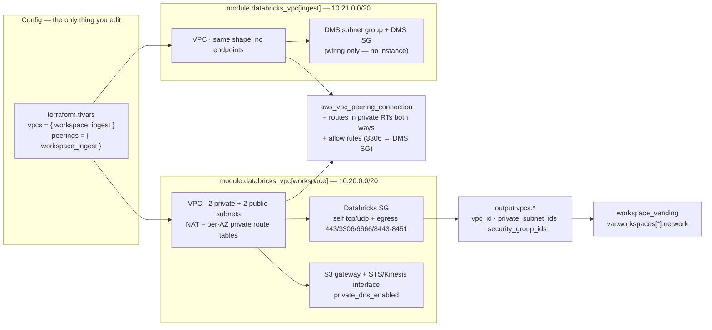

# network — customer-managed Databricks VPCs

Multi-VPC AWS networking for Databricks: a `vpcs` map results in one
`modules/databricks_vpc` instance per entry, peered together at the root. New
VPC = one map entry; its outputs can drop straight into `workspace_vending` project.

## The model

Two VPCs:

- **`workspace`** — the customer-managed VPC a Databricks workspace deploys
  into: 2-AZ private subnets (clusters) + public subnets (NAT only), the
  documented Databricks security-group rules, and the endpoint trio
  (S3 gateway + STS/Kinesis interface).
- **`ingest`** — where DMS-style landing infrastructure lives: same VPC shape,
  no Databricks endpoints, plus a DMS replication subnet group + security
  group (**wiring only** — for an example DMS project, see `lakeflow_connect/aws`; this
  shows where it moves in a multi-VPC layout).

Peering, cross-VPC routes, and the cross-VPC security-group rules are stitched
at the root (`peering.tf`) because they're inherently cross-instance — the
module stays peer-agnostic.



## Add a VPC = one map entry

| Field | Required | Default |
|---|---|---|
| `cidr` | ✅ | — (netmask /16../22; subnets are +4 newbits, so always inside Databricks' /17../26) |
| `az_count` | | `2` (Databricks minimum) |
| `enable_databricks_endpoints` | | `true` — S3 gateway + STS/Kinesis interface |
| `create_dms_subnet_group` | | `false` |
| `nat_per_az` | | `false` — single NAT (demo); `true` = one per AZ |
| `tags` | | `{}` |

A `peerings` entry names a `requester`/`accepter` pair plus an `allow` list;
each allow rule says which side's SG (`ingress_side`) receives ingress from the
other side's CIDR, on the `primary` (Databricks) or `dms` SG.

## Design notes

- **The Databricks SG rules are spelled out per rule** (`security.tf`) instead
  of a blanket all-egress: ingress is self-only (all TCP + all UDP —
  inter-node), egress is self + 443 (control plane/S3/STS/Kinesis), 3306
  (legacy Hive metastore), 6666 (secure cluster connectivity relay), 8443–8451
  (internal services). 2443 (FIPS compliance profile) is a commented stub.
- **Interface endpoints get their own SG** (443 from the VPC CIDR) so the
  exported workspace SG never needs mutating.
- **Kinesis endpoint is `kinesis-streams`** — the service Databricks actually
  uses — not plain `kinesis`.
- **Back-end PrivateLink is a commented stub** (`endpoints.tf`): two more
  interface endpoints against Databricks' regional `vpce-svc-*` services, then
  `databricks_mws_vpc_endpoint` + `mws_networks.vpc_endpoints` +
  `mws_private_access_settings` on the `workspace_vending` side.
- **Private route tables are always per-AZ**, even with the single-NAT
  default — flipping `nat_per_az` changes routes, not topology.
- **`dms-vpc-role`**: AWS requires this exact account-level role name before
  `CreateReplicationSubnetGroup`. `lakeflow_connect/aws` creates the same role
  — set `create_dms_vpc_role = false` when that root is applied (and beware
  the reverse: destroying this root removes the role from under a live DMS
  instance).
- **Local state on purpose** (no backend): apply → verify → destroy in one
  session; remote state would just leave a stale object behind.
- **`terraform.tfvars` is committed** (`git add -f`, governance precedent) —
  only CIDRs/flags, and it makes `EVIDENCE.md` reproducible against committed
  config.
- **`default_tags` on the provider is a repo first** — every resource carries
  `project = "network"`, which is what the evidence commands filter on.

## Verification

Static (in the repo's Terraform container):

```sh
terraform fmt -check -recursive
terraform init
terraform validate
terraform plan   # 74 to add on the committed tfvars
```

Live checks (before destroy — all captured in `EVIDENCE.md`):

```sh
terraform output -json vpcs        # contract: 3 fields, 2 subnets, 1 SG per VPC
terraform output -json peerings    # accept_status = "active"
aws ec2 describe-vpcs             --filters Name=tag:project,Values=network
aws ec2 describe-nat-gateways     --filter  Name=tag:project,Values=network
aws ec2 describe-route-tables     --filters Name=tag:project,Values=network   # NAT default + S3 prefix-list + pcx routes
aws ec2 describe-vpc-endpoints    --filters Name=tag:project,Values=network   # s3 Gateway + sts/kinesis-streams Interface
aws ec2 describe-vpc-peering-connections --filters Name=tag:project,Values=network
aws dms describe-replication-subnet-groups
```
