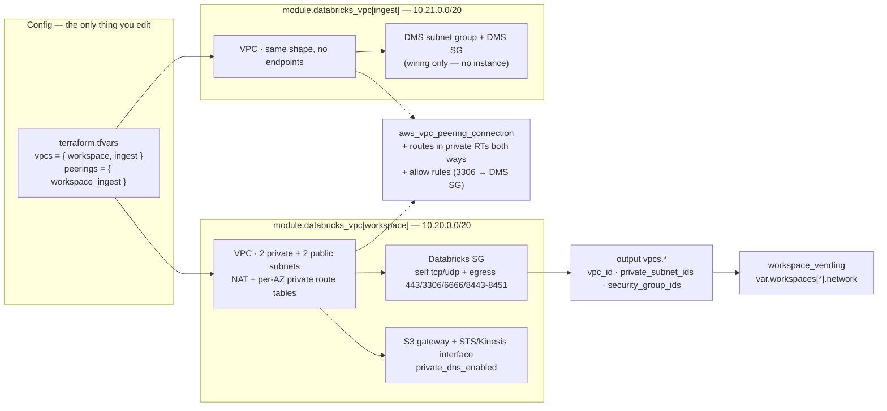

# network — customer-managed Databricks VPCs

Multi-VPC AWS networking for Databricks: a `vpcs` map results in one
`modules/databricks_vpc` instance per entry, peered together at the root. New
VPC = one map entry.

## The model

Two VPCs:

- **`workspace`** — the customer-managed VPC a Databricks workspace deploys
  into: 2-AZ private subnets (clusters) + public subnets (NAT only), the
  documented Databricks security-group rules, and the endpoint trio
  (S3 gateway + STS/Kinesis interface).
- **`ingest`** — where DMS-style landing infrastructure lives: same VPC shape,
  no Databricks endpoints, plus a DMS replication subnet group + security
  group (**wiring only** — for an example DMS project, see `lakeflow_connect/aws`; this
  shows where the ingest portion moves in a multi-VPC layout).

Peering, cross-VPC routes, and the cross-VPC security-group rules are stitched
at the root (`peering.tf`) because they're inherently cross-instance — the
module stays peer-agnostic.

## Add a VPC = one map entry

| Field | Required | Default |
|---|---|---|
| `cidr` | ✅ | — (netmask /16../22; subnets are +4 newbits, so always inside Databricks' /17../26) |
| `az_count` | | `2` (Databricks minimum) |
| `enable_databricks_endpoints` | | `true` — S3 gateway + STS/Kinesis interface |
| `create_dms_subnet_group` | | `false` |
| `nat_per_az` | | `false` — single NAT; `true` = one per AZ |
| `tags` | | `{}` |

A `peerings` entry names a `requester`/`accepter` pair plus an `allow` list;
each allow rule says which side's SG (`ingress_side`) receives ingress from the
other side's CIDR, on the `primary` (Databricks) or `dms` SG.
