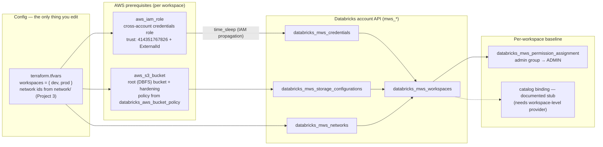

# workspace_vending — config-driven Databricks workspace creation on AWS

New workspace = one map entry. Each entry in `var.workspaces` creates the AWS
prerequisites (cross-account IAM role + root bucket) and the four account-level
registrations (`databricks_mws_*`) that make a workspace.

> **NOT Terraform applied — Free Edition.** Databricks Free Edition cannot create
> workspaces or authenticate to the account API
> (`accounts.cloud.databricks.com`). This root is written, `terraform
> validate`d, and documented; on a paid account with an account-admin service
> principal (`DATABRICKS_CLIENT_ID` / `DATABRICKS_CLIENT_SECRET` in the
> environment) it should work.

## The model

Every other root in this repo talks to a workspace (`DATABRICKS_HOST` /
`DATABRICKS_TOKEN`). Workspace *creation* lives one level up, at the
account, so this root establishes the account-level provider:

```hcl
provider "databricks" {
  alias      = "account"
  host       = "https://accounts.cloud.databricks.com"
  account_id = var.databricks_account_id
}
```

One `modules/workspace` instance per map entry owns the full chain — AWS
prerequisites are created in the module, so a workspace never depends on
hand-provisioned AWS pieces.



## Add a workspace = one map entry

```hcl
workspaces = {
  dev = {
    deployment_name = "acme-dev"
    custom_tags     = { env = "dev" }
    network = {
      vpc_id             = "vpc-..."
      private_subnet_ids = ["subnet-...", "subnet-..."]
      security_group_ids = ["sg-..."]
    }
  }
}
```

| Field | Required | Default |
|---|---|---|
| `network` (vpc_id, private_subnet_ids, security_group_ids) | ✅ | — |
| `workspace_name` | | the map key |
| `region` | | `var.aws_region` |
| `deployment_name` | | Databricks picks the URL |
| `pricing_tier` | | API default |
| `root_bucket_name` | | `<resource_prefix>-<key>-root` |
| `admin_group_id` | | `var.admin_group_id` |
| `workspace_catalogs` | | `[]` |
| `custom_tags` | | `{}` |

Root-level knobs: `databricks_account_id` (sensitive; doubles as the IAM
`sts:ExternalId`), `aws_region` (default `us-east-2`), `resource_prefix`,
`admin_group_id`, `force_destroy_root_buckets`.

## Free Edition notes — what breaks where

| Step | Free Edition | Why |
|---|---|---|
| `terraform validate` | ✅ clean | no API calls at all |
| `terraform plan` | ⚠️ needs AWS creds + some databricks auth to configure providers | the `databricks_aws_*` data sources are local-compute, so no *account* calls — but the provider still wants auth config |
| `terraform apply` | ❌ fail | `mws_*` resources hit `accounts.cloud.databricks.com`, which Free Edition credentials cannot reach (401) |